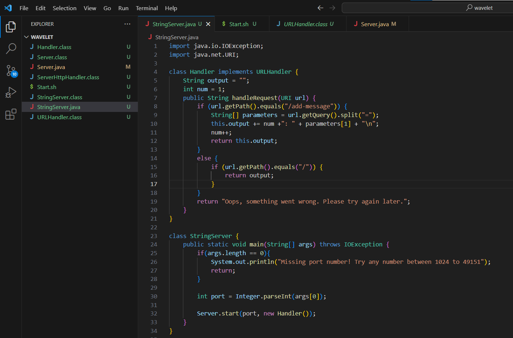
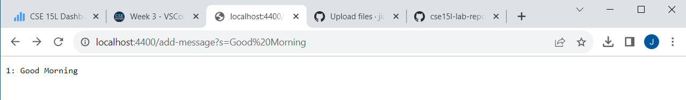
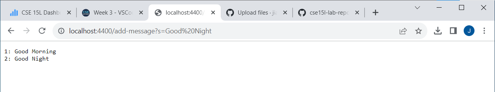

StringServer Code
=========

**1:** 

**2:** 

* Which methods in your code are called?

The method(s) that are being called in my code are the handleRequest method which is responsible for geting the message from the URL and display it on the website. It did not called the main method because it is responsible for starting up the server and I have already start it before I type the message.

* What are the relevant arguments to those methods, and the values of any relevant fields of the class?

The relevant argument(s) to the handleRequest method is the URL. The values of the class are variables called num which contain a number and output which contain an empty string.

* How do the values of any relevant fields of the class change from this specific request? If no values got changed, explain why.

The values of the class change as it go through the loop since the handleRequest method will take the message from the URL and add that into the message value which will then get return and display on the website. As for the number, it will add one every time there's a new message being enter in the URL.

**3:** 

* Which methods in your code are called?

The method(s) that are being called in my code are the handleRequest method which is responsible for geting the message from the URL and display it on the website.

* What are the relevant arguments to those methods, and the values of any relevant fields of the class?

The relevant argument(s) to the handleRequest method is the URL. The values of the class are variables called num which contain a number and output which contain an empty string.

* How do the values of any relevant fields of the class change from this specific request? If no values got changed, explain why.

The values of the class change as it go through the loop since the handleRequest method will take the message from the URL and add that into the message value which will then get return and display on the website. As for the number, it will add one every time there's a new message being enter in the URL.
